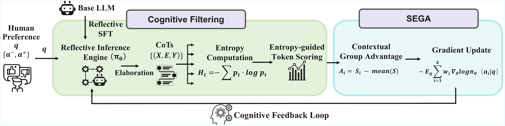
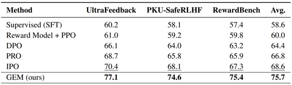
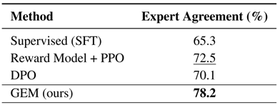
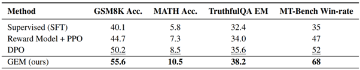

<p align="center">
  
</p>

<a href='https://arxiv.org/abs/2511.13007'></a>

💻 This repository is the official implementation of the **GEM**.

✅ The paper [**GEM: Generative Entropy-Guided Preference Modeling for Few-shot Alignment of LLMs**](https://arxiv.org/abs/2511.13007) has been accepted by [**The 40th AAAI Conference on Artificial Intelligence (AAAI) 2026**](https://aaai.org/conference/aaai/aaai-26/).

**GEM** is designed for LLMs alignment at low-resource and domain-specific scenarios. Instead of training a discriminative reward model on preference data, GEM directly train the LLM to internalize a closed-loop optimization architecture that can extract and exploit the multi-dimensional, fine-grained cognitive signals implicit in human preferences.

#### Authors
Yiyang Zhao, Huiyu Bai, [Xuejiao Zhao*](https://zxjwudi.github.io/xuejiaozhao/)

**Nanyang Technological University  &nbsp; | &nbsp; LILY Research Centre (NTU) &nbsp; |&nbsp; ANGEL Research Institute (NTU)**

\* Corresponding author

[](https://github.com/SNOWTEAM2023/GEM/stargazers)

---

## 🌈 News
* **[2025.12.1]** We release github repository of **GEM**. 💪 Have a try！
* **[2025.11.17]** We release the preprint of **GEM** on [arXiv](https://arxiv.org/abs/2511.13007).
* **[2025.11.08]** Accepted as an **Oral presentation** to AAAI 2026. 🎉

## 🧭 Framework Overview

<p align="center">
  
</p>
    <p align="center"><em>Figure 1: Overview of GEM.</em></p >

This repository implements:

- **Cognitive Filtering**: generate `k` Chain-of-Thought (CoT) candidates per query and **rank** them by **entropy-guided** scoring.  
- **SEGA**: Self-Evaluated Group Advantage — a **listwise** objective that updates the policy using **group-mean–centered advantages**.

> Entropy-guided scoring (Eq. 1): encourage **exploration mid‑CoT** (high entropy on top‑m steps) and **confidence at the end** (low final entropy).  
> SEGA objective (Eq. 2): update with weights proportional to **Aᵢ = rᵢ − r̄** within each k-way group.

---

## Quickstart


### 0) Install
```bash
python -m venv .venv && source .venv/bin/activate
pip install -e .  # or: pip install -r requirements.txt
```

### 1) Data

This project expects *preference pairs* of the form:
```jsonl
{"prompt": "...", "chosen": "...", "rejected": "..."}
```
A tiny synthetic set is provided under `data/synthetic/` to sanity-check the pipeline. For real runs, point to public datasets after you have download permissions.

### 2) Stage A — SFT (reflective SFT, optional but recommended)

```bash
python scripts/train_sft.py \
  --model_name_or_path meta-llama/Meta-Llama-3-8B-Instruct \  --train_jsonl data/synthetic/pairs.jsonl \  --out_dir outputs/sft-demo \  --epochs 1 --lr 1e-5 --batch_size 1
```

### 3) Stage B — SEGA (Generative Preference Optimization)

```bash
python scripts/train_sega.py \
  --model_name_or_path outputs/sft-demo \
  --train_jsonl data/synthetic/pairs.jsonl \
  --out_dir outputs/sega-demo \
  --k 4 --lambda_fork 0.4 --top_m 0.1 --reward_mapping softmax --beta 1.0 \
  --gen_max_new_tokens 256 --temperature 1.0 --top_p 0.95 \
  --epochs 1 --lr 5e-6 --batch_size 1
```

### 4) Evaluate preference accuracy (implicit reward)

```bash
python scripts/eval_pref_accuracy.py \
  --model_name_or_path outputs/sega-demo \
  --eval_jsonl data/synthetic/pairs.jsonl --beta 1.0
```

---

## Repository layout

```
genpref_sega/
  data/                 # dataset adapters & JSONL loader
  models/               # HF model utilities
  sampling/             # CoT sampling with output_scores
  scoring/              # entropy scorer (Eq. 1)
  sega/                 # SEGA loss & trainer (Eq. 2)
  utils/                # logging, seeding, prompts, config
scripts/
  train_sft.py
  train_sega.py
  eval_pref_accuracy.py
configs/
  sega_demo.yaml
data/synthetic/
  pairs.jsonl
```

---

## Implementation notes

- **Entropy-guided scoring** implements: *final-answer entropy penalty* and *top‑m fork entropies* average per Eq. (1).
- **SEGA** implements group-mean baseline and advantage weighting per Eq. (2) with `wᵢ ∝ Aᵢ`. We provide `identity` or `softmax` mapping from score → reward.
- **Cognitive filtering** also supports optional trimming of low-scoring outliers and pairing top/bottom candidates before optimization.
- The provided **evaluation** uses `r(q,a)=β·log πθ(a|q)` for two-way comparisons.

> See comments in code for per‑step references back to the paper’s sections, equations, and figures.

---

## Reproducibility knobs
- `k`: number of CoT candidates per query
- `lambda_fork (λ)`: weight for fork entropy term in Eq. (1)
- `top_m`: fraction or count for top‑entropy tokens used in Eq. (1)
- `reward_mapping`: `identity` or `softmax`
- `beta`: implicit reward scale in `r(q,a)`


## Dataset

The project primarily utilizes the following two types of datasets for training and evaluation as described in the paper:

1. **General Domain Dataset**: We selected the publicly available ["Skywork-Reward-Preference-80K-v0.2"]("Skywork-Reward-Preference-80K-v0.2") as the base preference data. For few-shot scenarios, we used a small number of high-quality samples (approximately 3,000) for experimentation and tested on public benchmarks such as

- [UltraFeedback](https://github.com/OpenBMB/UltraFeedback) A large-scale, fine-grained, and diverse preference dataset, containing prompts from various resources, and annotated by GPT-4 in four aspects: instruction following, authenticity, honesty, and usefulness.
- [PKU-SafeRLHF](https://github.com/PKU-Alignment/safe-rlhf) A human-annotated preference dataset, containing over 300,000 human-labeled comparison data points, covering preferences for usefulness and harmlessness, aimed at promoting research on the safe alignment of large language models.
- [Reward Bench](https://huggingface.co/spaces/allenai/reward-bench) A dataset for evaluating the capabilities of reward models, covering multiple categories including chat, reasoning, and safety, is designed to test the performance of reward models in complex and structured queries.


2. **Medical Domain Dataset**: To verify the effectiveness of the method in specialized scenarios, the paper constructed a medical preference dataset simulating a low-resource environment based on the [iCliniq](https://www.icliniq.com/) dataset. The dataset consists of 3,500 entries, with 3,000 used for training and 500 for validation. The data is derived from anonymized segments of real clinical conversations and publicly available medical data. It has undergone deduplication, normalization, anonymization, and expert annotation to form a structured preference format of (question, answer_pos, answer_neg).

When reproducing or conducting research using the above datasets, please note the following points:

- The preprocessing and filtering methods for the general domain dataset are detailed in the paper and script comments. It is recommended to ensure that there is no overlap between the training and test sets before training.
- If you have other custom preference data (such as for question-answering or dialogue scenarios), you can also integrate it into the same process in the format of (question, answer_neg, answer_pos).


## Experimental Results

### Main Results


<p align="center">
  
</p>

*Table 1:Preference-prediction accuracy (%). Higher is better, and the best performing method in each experiment is in bold and the second-best method is indicated with underlining*


<p align="center">
  
</p>

*Table 2: Agreement with medical-expert preferences on the 500-sample validation set.*

<p align="center">
  
</p>


*Table 3: Down-stream task results. Accuracy (%) for GSM8K / MATH, exact-match (%) for TruthfulQA; MT-Bench reports win-rate (%) against the SFT baseline.*


## Citation

If you find GEM helpful in your research, please cite our paper:

```bibtex
@article{zhao2025gem,
  title={GEM: Generative Entropy-Guided Preference Modeling for Few-shot Alignment of LLMs},
  author={Zhao, Yiyang and Bai, Huiyu and Zhao, Xuejiao},
  journal={arXiv preprint arXiv:2511.13007},
  year={2025}
}
```

## License
This work is licensed under the [Creative Commons Attribution-NonCommercial 4.0 International License](http://creativecommons.org/licenses/by-nc/4.0/).
Commercial use is prohibited without a separate license agreement with the author.


